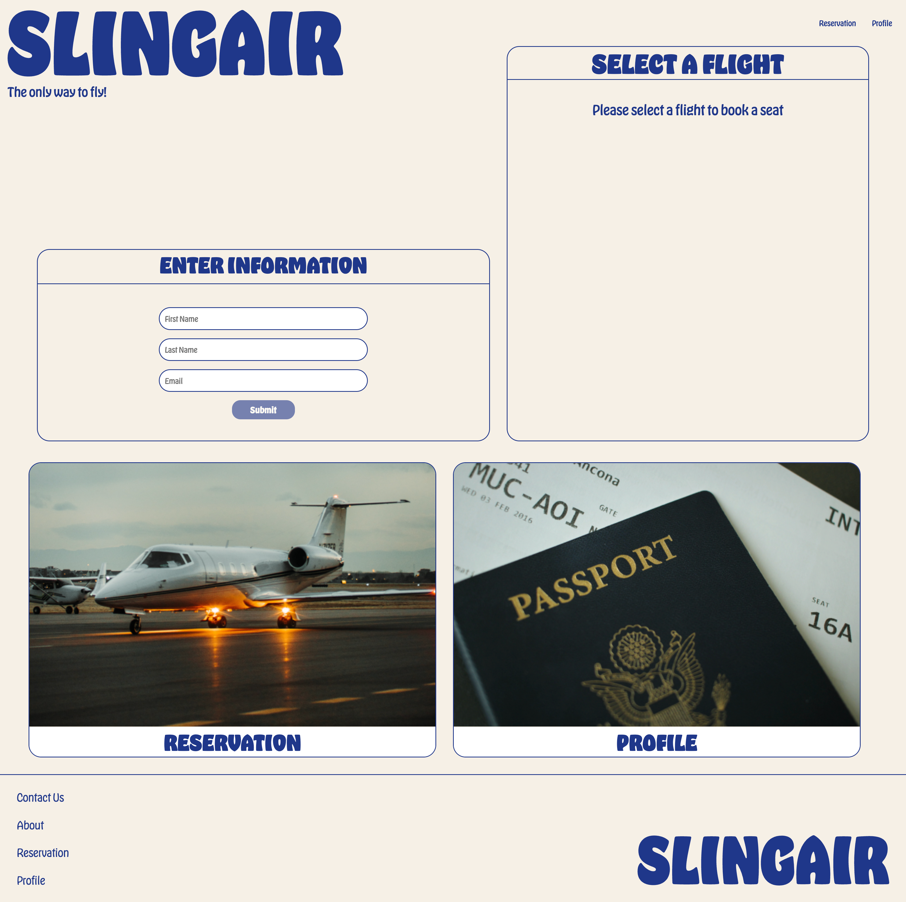
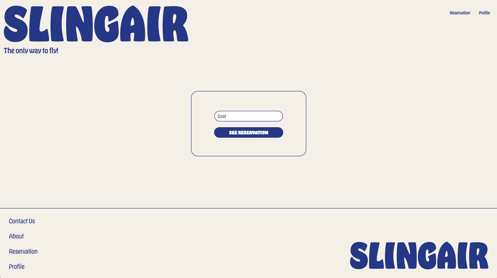

# Slingair

# Introduction

Slingair is an airline site that combines both front-end and back-end. It is used to book your flight and to search up your reservations.

# Project

## Coding Languages

Slingair uses React.js for the front-end. For the back-end, I use Node.js as well as Mongo.db.

## Home

On the home page, you can enter your information and then select your flight. Once the flight is selected, you can choose your seat within the plane. It will only show the seats that are available. After the seat selection, you can submit your information, which will redirect the user to a confirmation page on their flight.

## Reservation

On the reservation page, you can enter your seat number and it will retreive the reservation information of the user. However, if there is an error in the input, there will be a page that will communicate the error and the user can try again.

